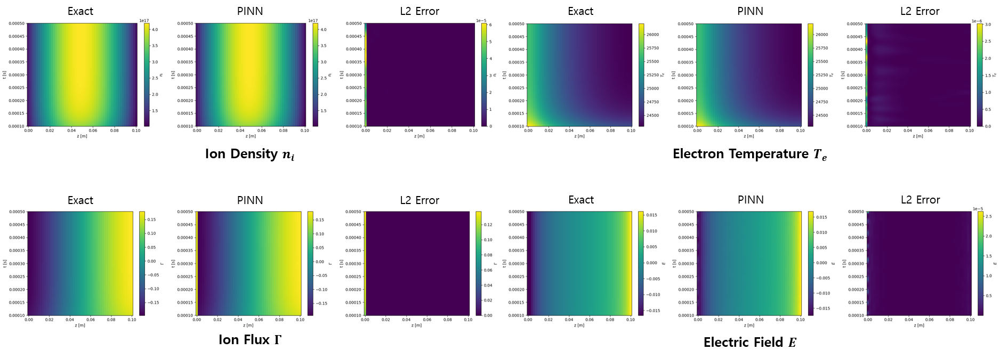

## ⚠️ Plasma (Restricted Data & Models)

This repository includes a PINN-based approach for plasma simulation.  
However, due to company policy, certain components are not publicly available.

### Data and Model Availability

- The dataset provided by the company is not publicly available.
- Trained model files (e.g., `.pkl`) are not included.

### Scope of This Work

This project focuses on stabilizing PINN training for **complex and stiff coupled physical systems**, such as plasma dynamics.

### Context

Plasma simulation involves highly nonlinear and stiff systems, making it challenging for standard PINN approaches to:

- Achieve stable convergence
- Capture multi-scale physical behavior
- Maintain consistency with numerical solutions :contentReference[oaicite:0]{index=0}

### Approach

We explore PINN-based methodologies to improve training robustness under these conditions, including:

- Handling stiff PDE systems
- Improving training stability
- Incorporating physics constraints effectively

### Experimental Setting

- 1D Argon ICP plasma problem
- 1D Argon DC plasma problem
- Both steady-state and time-dependent regimes evaluated

### Observations

- Physics-only training captures general trends but lacks accuracy
- Adding data loss significantly improves agreement with numerical solutions
- The model demonstrates stable inference from initial conditions to steady state :contentReference[oaicite:1]{index=1}

### Notes

This section is intended to demonstrate the methodology and training behavior.  
Due to data restrictions, full reproducibility is not provided.

### results
